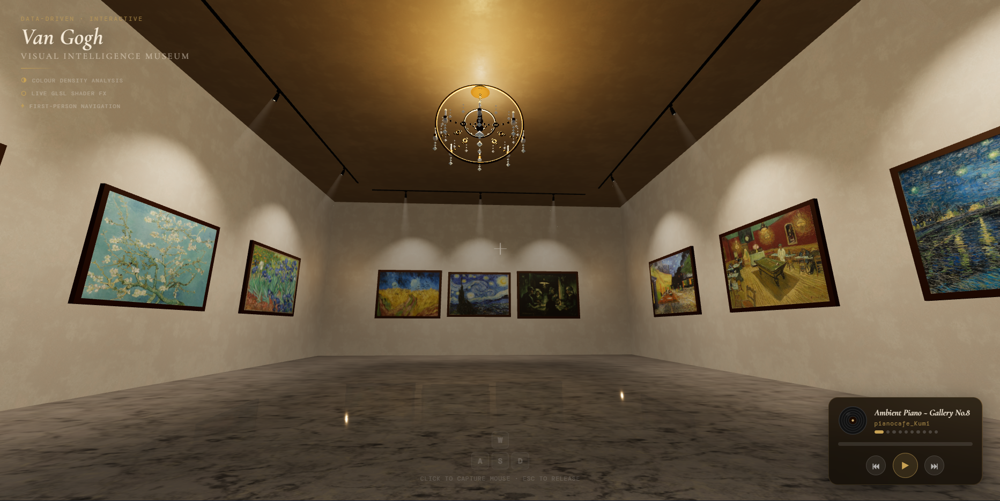
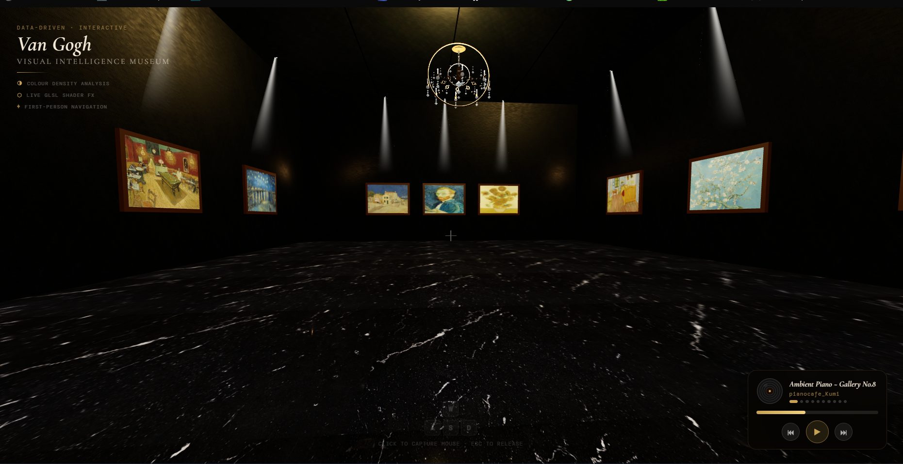
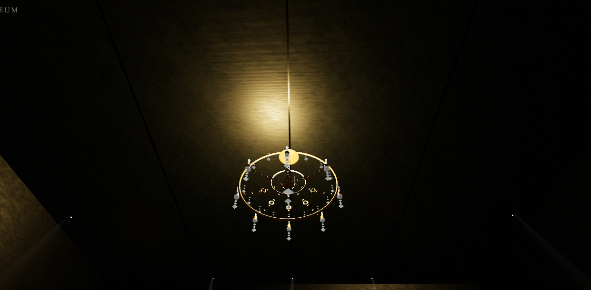
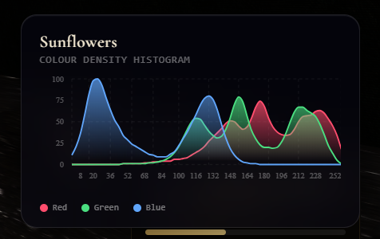
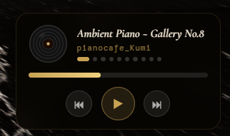

# 🖼️ Van Gogh — Visual Intelligence Museum

> An immersive, first-person 3D art gallery built with React Three Fiber, featuring real-time spotlight rendering, procedural lighting, colour histogram analysis, and live GLSL shader effects.

---

## ✨ Features

- **First-Person Navigation** — WASD movement with mouse-look inside a fully modelled gallery room
- **12 Van Gogh Paintings** — distributed across 4 walls with individual track spotlights
- **Procedural Chandelier** — classical 8-arm chandelier built entirely from Three.js primitives (no external model)
- **Real-Time Spotlights** — per-painting SpotLight with penumbra, attenuation, and ceiling glow halos
- **Marble Reflector Floor** — `MeshReflectorMaterial` with blur, depth scale, and PBR marble textures
- **Colour Density Analysis** — live RGB histogram overlay when hovering a painting
- **Live GLSL Shader FX** — animated shader applied to The Starry Night canvas
- **Painting Info Panel** — contextual metadata panel per artwork
- **Music Player** — 10-track classical playlist (Satie, Einaudi, Debussy, Richter, Glass...) with seek bar, progress, and auto-advance
- **SVG Favicon** — custom Starry Night-inspired icon

---

## 🛠️ Tech Stack

| Layer        | Technology                                                                                     |
| ------------ | ---------------------------------------------------------------------------------------------- |
| 3D Rendering | [Three.js](https://threejs.org/) + [React Three Fiber](https://docs.pmnd.rs/react-three-fiber) |
| 3D Helpers   | [@react-three/drei](https://github.com/pmndrs/drei)                                            |
| UI Framework | [React 18](https://react.dev/)                                                                 |
| Build Tool   | [Vite](https://vitejs.dev/)                                                                    |
| Shaders      | GLSL (custom vertex + fragment shaders)                                                        |
| Audio        | HTML5 Web Audio API                                                                            |
| Fonts        | Cormorant Garamond + DM Mono (Google Fonts)                                                    |

---

## 🎮 Controls

| Input            | Action                                 |
| ---------------- | -------------------------------------- |
| `Click`          | Capture mouse / lock pointer           |
| `W A S D`        | Move forward / left / backward / right |
| `Mouse`          | Look around                            |
| `ESC`            | Release mouse                          |
| `Hover painting` | Show colour histogram + info panel     |

---

## 🎨 Paintings Featured

| Wall  | Paintings                                                                 |
| ----- | ------------------------------------------------------------------------- |
| Back  | Wheatfield with Crows · The Starry Night _(animated)_ · The Potato Eaters |
| Left  | Irises · Almond Blossom · The Bedroom                                     |
| Right | Café Terrace at Night · The Night Café · Starry Night Over the Rhône      |
| Front | Sunflowers · Self-Portrait · The Yellow House                             |

---

## 💡 Technical Highlights

### Lighting Architecture

The gallery uses a layered lighting system: a `HemisphereLight` for ambient fill, 12 individual `SpotLight`s (one per painting) with warm `#fff2d8` colour and tuned penumbra, a procedural chandelier with its own `PointLight`, and emissive ceiling glow halos above each track fixture — all without shadow casting for performance.

### Procedural Chandelier

The chandelier is engineered entirely from Three.js primitives — `TorusGeometry` rings, `CylinderGeometry` rods, `OctahedronGeometry` crystal drops (detail=0 for sharp facets), and `SphereGeometry` flames with high `emissiveIntensity` that blooms under ACES filmic tone mapping. Arms are distributed via polar coordinate math across 8 evenly spaced angles.

### GLSL Shader on Starry Night

A custom `ShaderMaterial` is layered over The Starry Night painting mesh, animating swirling noise in the UV space to simulate Van Gogh's characteristic brushwork motion in real time.

### Colour Histogram

On hover, the painting's texture is sampled via a hidden `<canvas>` element, pixel data is binned into 256-bucket RGB histograms, and rendered as a live overlay — a nod to the data-driven theme of the project.

---

## 🎵 Playlist

1. Ambient Piano ~ Gallery No.8 — _pianocafe_Kumi_
2. Gymnopédie No.1 — _Erik Satie_
3. On the Nature of Daylight — _Max Richter_
4. Experience — _Ludovico Einaudi_
5. Clair de Lune — _Claude Debussy_
6. Comptine d'un autre été — _Yann Tiersen_
7. Spiegel im Spiegel — _Arvo Pärt_
8. River Flows in You — _Yiruma_
9. Nuvole Bianche — _Ludovico Einaudi_
10. Metamorphosis Two — _Philip Glass_

---

## 📸 Screenshots

| View              | Preview                                            |
| ----------------- | -------------------------------------------------- |
| Main gallery      |              |
| Chandelier detail |  |
| Histogram overlay |    |
| Music player      |          |

## 👤 Author

**Anas Berrqia**
3rd Year Data Science & AI Student · Freelance Developer

- LinkedIn: [linkedin.com/in/anas-berrqia](https://www.linkedin.com/in/anas-berrqia-37b653346/)
- GitHub: [@DevWizard82](https://github.com/DevWizard82)
